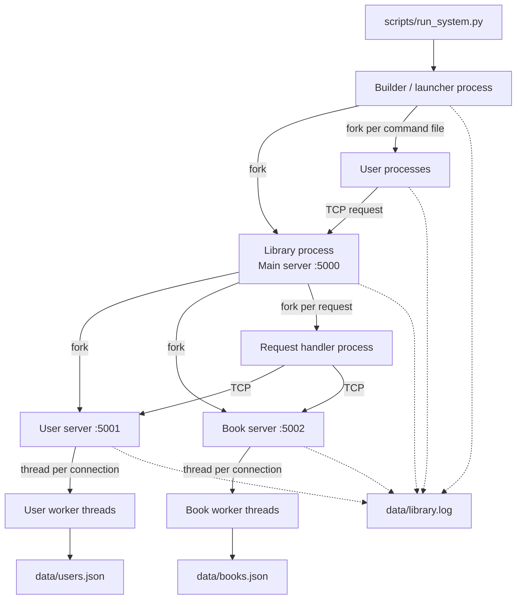

# Concurrent Library System

A Unix-based concurrent library simulator written in Python to explore operating-system concepts such as **process creation, threads, TCP sockets, synchronization, file locking, inter-process communication, and persistent state**.


## What this project demonstrates

- Process creation with `os.fork()`
- Per-request process handling in the main TCP server
- Per-connection worker threads in the user and book services
- TCP communication over localhost
- Synchronization with `threading.Lock`
- Cross-process log serialization with `fcntl.flock`
- JSON-backed runtime persistence
- Scripted concurrent clients driven by command files

## Architecture



The main server acts as the coordinator. User processes send commands to it over TCP; request handlers then delegate user-related operations to the user service and book-related operations to the book service. The two service processes use worker threads and in-process locks to protect their mutable state.

For a deeper walkthrough, see [Architecture](docs/architecture.md) and [Protocol](docs/protocol.md).

## Repository layout

```text
.
├── README.md
├── LICENSE
├── .gitignore
├── clients/
│   ├── client.py
│   ├── user1.txt
│   └── user2.txt
├── docs/
│   ├── architecture.md
│   └── protocol.md
├── examples/
│   ├── demo_user1.txt
│   └── demo_user2.txt
├── scripts/
│   └── run_system.py
└── src/
    ├── config.py
    ├── logger.py
    ├── main.py
    ├── persistence.py
    ├── processes/
    │   └── user_process.py
    └── servers/
        ├── main_server.py
        ├── user_server.py
        └── book_server.py
```

The `data/` directory is generated at runtime and is intentionally excluded from Git.

## Requirements

- Python 3
- A Unix-like environment with `fork()` and `fcntl` support
  - Linux and macOS are suitable targets.
  - On Windows, use WSL rather than native Python.
- No third-party Python packages are required.

## Run the system

From the repository root:

Use the scenarios in `examples/` for a reproducible concurrent demo. They begin with a short delay so the servers have time to bind before the first client request:

```bash
python scripts/run_system.py examples/demo_user1.txt examples/demo_user2.txt
```

The command files in `clients/` provide additional sample scenarios. Each command file is executed by a separate user process. Runtime activity is written to `data/library.log`, while user and book state are stored in `data/users.json` and `data/books.json`.

The servers are long-running processes, so stop the demo with `Ctrl+C` when you are finished.

## Client command files

A user scenario is described by one command per line:

```text
Register
Register_book Harry_Potter
Lend Harry_Potter
Sleep 2.0
Return Harry_Potter
```

Supported commands are:

- `Register`
- `Register_book <book title>`
- `Lend <book title>`
- `Return <book title>`
- `Sleep <seconds>`

See [Protocol](docs/protocol.md) for the external and internal request formats.

## Synchronization and persistence

The project intentionally uses more than one synchronization mechanism:

- `threading.Lock` protects user and book state inside their respective service processes.
- `fcntl.flock` serializes writes to the shared log file across processes.
- JSON files provide simple persistence for user and book state.

These choices keep the concurrency model explicit and make the interaction between processes, threads, sockets, locks, and persistent state easy to inspect.

## Known limitations

- The system is bound to `localhost` and fixed ports `5000`, `5001`, and `5002`.
- The TCP protocol is intentionally minimal and has no explicit message framing or protocol versioning.
- Startup does not include a readiness barrier between servers and clients, so very slow machines can expose a startup race.
- Forked request-handler processes are not explicitly reaped by the main server.
- There is no graceful shutdown protocol; the demo is stopped from the terminal.


## License

The source code and repository documentation are released under the [MIT License](LICENSE).

Before publishing coursework publicly, make sure doing so is permitted by your course or university policy.