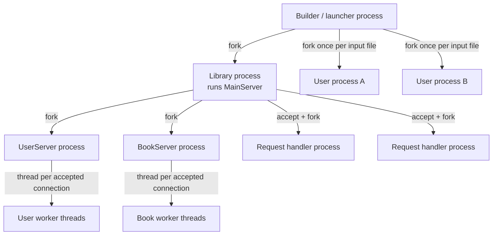
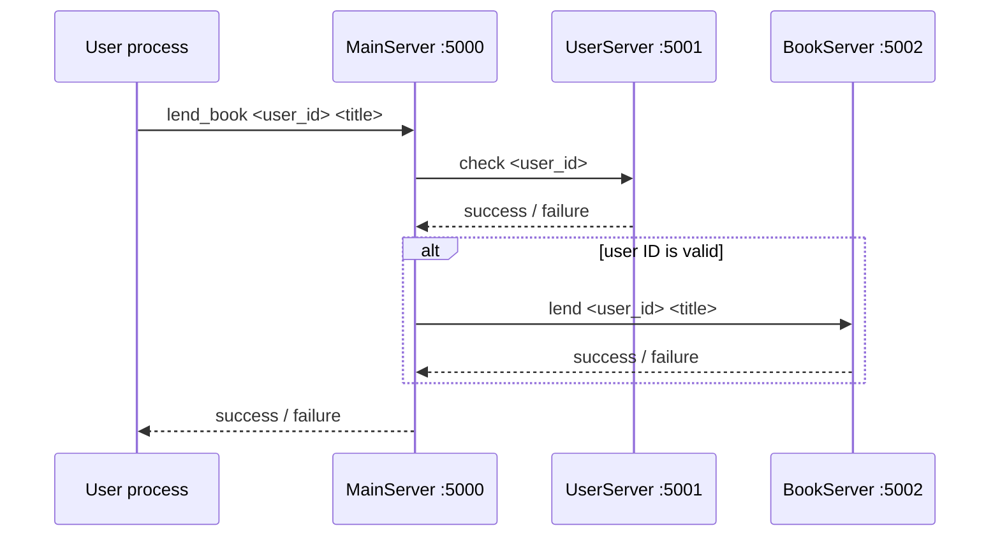

# Architecture

This document describes the process, thread, networking, synchronization, and persistence model implemented by the system.

## Process and thread model

The system starts in a launcher process through `scripts/run_system.py`, which invokes `src.main.main()`.



### Builder / launcher process

`src/main.py` performs four orchestration tasks:

1. Clears the runtime log.
2. Forks the library process.
3. Forks one user process for each supplied command file.
4. Waits for child processes.

### Library process and main server

The library child process starts two additional service processes and then runs `MainServer` itself on port `5000`.

`MainServer` is the public coordinator for library operations. For every accepted TCP connection, it forks a request-handler process. That handler reads one command, delegates work to the appropriate service, sends one response, and exits.

### User service

`UserServer` runs in its own process on port `5001`. Every accepted connection is handled by a new thread.

It owns:

- the username-to-ID mapping,
- the set of valid user IDs,
- the next user ID,
- a `threading.Lock` protecting those structures and persistence writes.

### Book service

`BookServer` runs in its own process on port `5002`. Like `UserServer`, it creates a worker thread per accepted connection.

It owns:

- the book-title mapping,
- each book's current borrower (or `null` when available),
- a `threading.Lock` protecting book state and persistence writes.

### User processes

Every command file passed to the launcher becomes a separate user process. A user process reads its file sequentially and opens a new TCP connection to the main server for each library operation.

`Sleep` is handled locally and is useful for shaping concurrent scenarios.

## Request flow

A `Lend` command illustrates the end-to-end path:



A return follows the same validation path before the book service checks whether the requesting user is the current borrower.

## Synchronization model

### Shared log file

All participating processes may write to `data/library.log`. `src/logger.py` opens the file in append mode and uses `fcntl.flock(..., LOCK_EX)` around each write.

This is a **cross-process file lock**, which prevents concurrent log writes from interleaving at the application level.

### User and book state

The user and book services each keep their mutable data in memory and serialize state-changing operations with `threading.Lock`.

Because each table is owned by exactly one service process in this implementation, the lock only needs to coordinate worker threads inside that process.

## Persistence

`src/persistence.py` provides two small JSON helpers:

- `load_json(path, default)` loads existing state or returns a default value.
- `save_json(path, data)` creates the parent directory when necessary and rewrites the JSON file.

Runtime files are intentionally ignored by Git:

```text
data/library.log
data/users.json
data/books.json
```

This keeps the repository deterministic while still allowing state to persist between local runs.

## Ports

| Service | Port | Role |
| --- | ---: | --- |
| Main server | `5000` | Public entry point for user requests |
| User server | `5001` | Registration and user-ID validation |
| Book server | `5002` | Book registration, lending, and returns |

All services bind to `localhost`.

## Design trade-offs

The implementation deliberately favors visible OS primitives over abstraction. Forking, sockets, locks, and file persistence are kept close to the request flow so their behavior is easy to inspect.

Keeping these mechanisms explicit also leaves several limitations: there is no connection pool, graceful shutdown protocol, startup readiness barrier, wire-format versioning, or explicit child-process reaping in the main server.